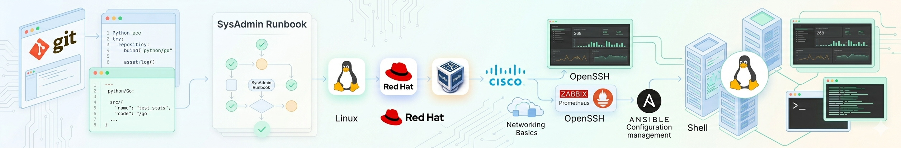

## Pavlo - Linux System Administrator

I design, troubleshoot, and maintain reliable Linux systems.
Focused on automation, incident analysis, and resolving real-world infrastructure issues.

🔹 **Core:** Linux, Bash, troubleshooting 
🔹 **Working with:** Nginx, PostgreSQL, Docker, monitoring stack 
🔹 **Background:** Frontend → System Administration (strong debugging mindset) 
🔹 **Approach:** Documentation-first, systematic problem solving, RCA-driven 

---

### 🛠️ Tech Stack

**Systems & Administration:**  

**Monitoring & Observability:**  

**Containerization & Automation:**  

**Scripting & Development:**  

**Troubleshooting Practice:**  

---

### 📚 Certifications

---

### 🚀 Featured Projects

#### **[Ops Runbook](https://github.com/0c2pus/ops-runbook)**
Real-world troubleshooting scenarios with structured Root Cause Analysis.

**Highlights:**

- 40+ incident scenarios (Linux, networking, PostgreSQL, Docker)
- L2/L3-style troubleshooting workflow (Investigation → RCA → Resolution)
- Production-style documentation and runbooks
- Covers real issues: resource exhaustion, networking failures, DB auth, SSL, containers

---

#### **[GitOps & Infrastructure Practice](https://github.com/0c2pus/devops-portfolio-project)**
Hands-on infrastructure automation and monitoring setup.

**Highlights:**

- Docker-based services and multi-stage builds
- Basic Kubernetes deployments
- Monitoring stack (Prometheus + Grafana)
- GitOps workflows and CI/CD automation

---

### 📊 GitHub Stats

